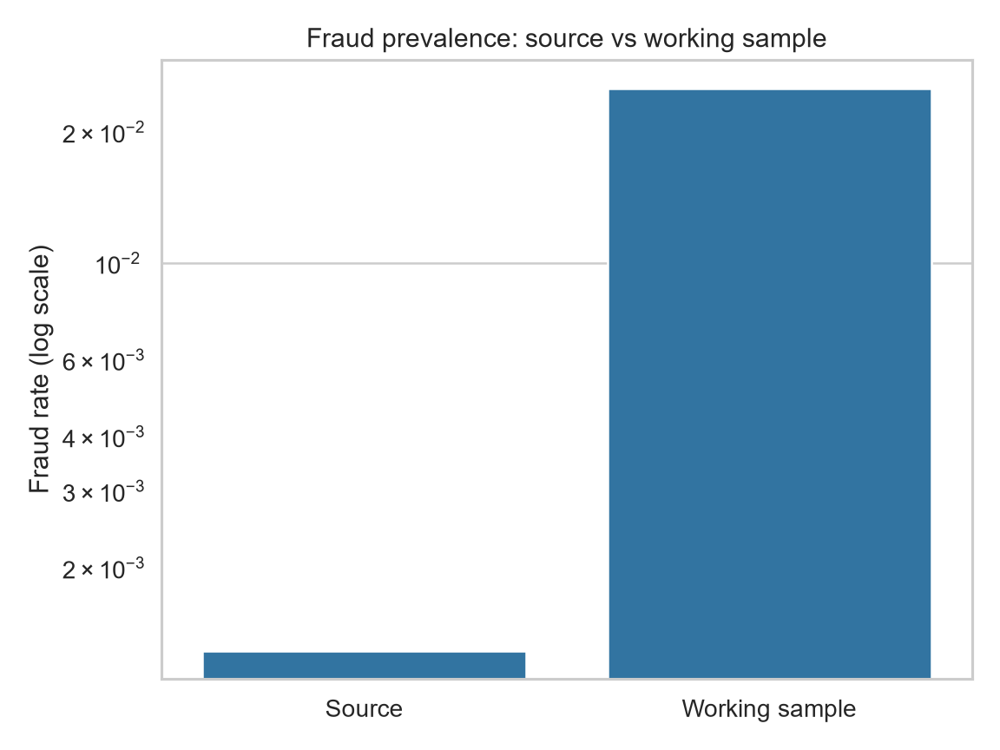
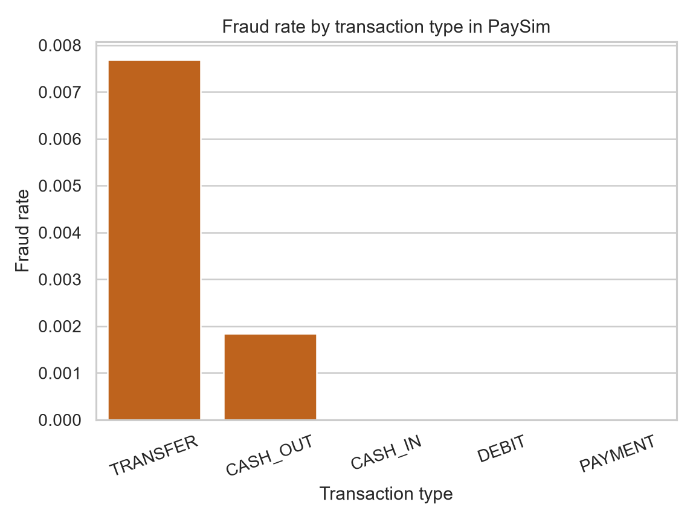
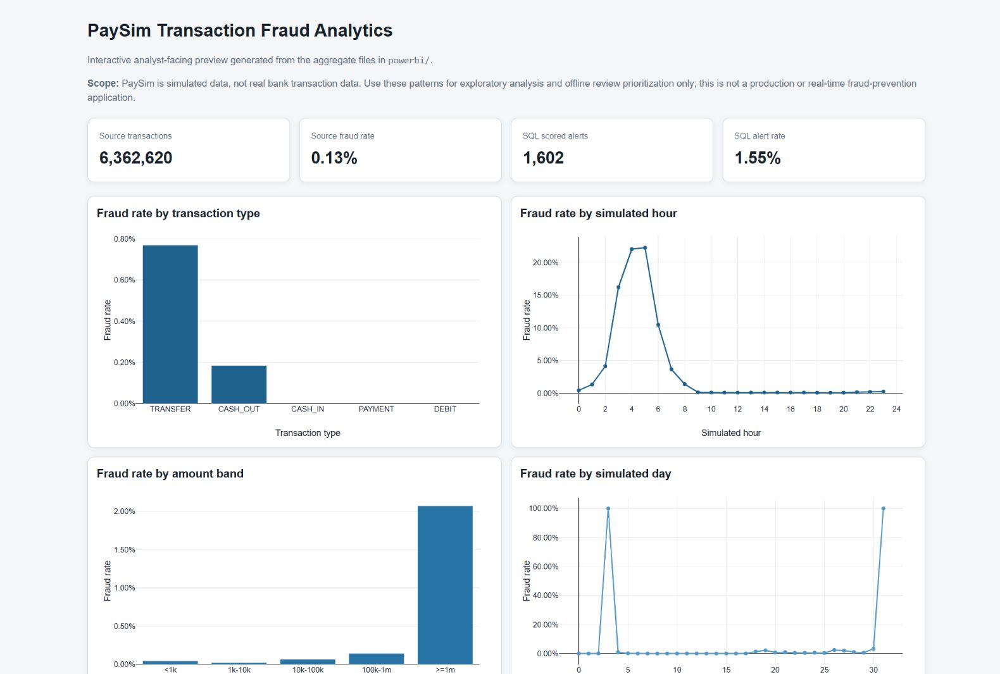
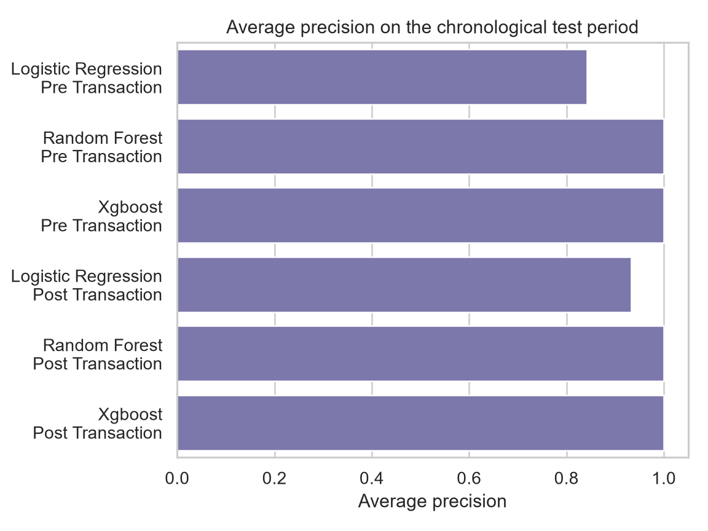

# PaySim Transaction Fraud Analysis

An analyst-facing transaction fraud analytics and BI reporting project built on simulated mobile-money transactions. The workflow leads with SQL/DuckDB analysis, fraud patterns, risk segments and BI-ready reporting, then adds model-based review prioritization and technical evaluation.

## Project at a Glance

| Evidence | Verified value |
| --- | ---: |
| Source transactions | 6,362,620 |
| Source fraud prevalence | 0.12908% |
| Row-level data distribution | Not included in the current tree |
| Final chronological test | 103,573 transactions |
| Best canonical post-transaction F1 | 0.9997 — validation-selected Random Forest, final chronological test |

## Key Findings

- Across 6,362,620 source transactions, the source fraud prevalence is 0.12908%, so the project analyzes a highly imbalanced transaction environment. These source counts are recorded in [`results/data_summary.json`](results/data_summary.json) and [`results/sql/total_transactions.csv`](results/sql/total_transactions.csv).
- Simulated fraud is concentrated in `TRANSFER` and `CASH_OUT`. The `>=1m` amount band has a 2.0715% simulated fraud rate versus 0.1404% in the `100k-1m` band; these are screening signals for closer review, not fraud rules or causal explanations. See [`results/sql/fraud_by_amount_band.csv`](results/sql/fraud_by_amount_band.csv) and [`docs/business_analysis.md`](docs/business_analysis.md).
- The DuckDB/SQL layer is the direct analyst-facing deliverable: it reports transaction totals, fraud rate and fraud amount by type, simulated hour/day, amount band, high-risk type/hour segment and scored alert output, with a model/threshold alert-rate comparison for review analysis. The outputs are reusable aggregate tables for reporting and review prioritization.
- Within PaySim, the post-transaction Random Forest strongly separates the simulated fraud/non-fraud labels, reaching F1 0.9997 at a 1.5438% alert rate on the final chronological test. This can support offline study of alert prioritization in the simulator, but it does not establish real-world banking performance.
- Scope remains explicit: post-transaction monitoring uses new balances and residual/accounting features; pre-transaction results are a screening comparison only. Neither scope is presented as real-time prevention or pre-authorization.

## Analytical Question

How well can transaction-level information in the PaySim simulation distinguish fraudulent transactions, and what patterns are associated with fraud within this simulated environment?

## Data Source and Scope

The project uses the simulated [PaySim dataset](https://www.kaggle.com/datasets/ealaxi/paysim1). PaySim row-level data is not distributed with this repository: the approximately 470 MB raw CSV must be obtained from a permitted source copy and kept locally outside Git. See [`data/README.md`](data/README.md), [`docs/data_sources.md`](docs/data_sources.md), and [`docs/limitations.md`](docs/limitations.md).

The official portfolio scope is **post-transaction monitoring** because it uses `newbalanceOrig` and `newbalanceDest`. The pre-transaction feature set is a screening comparison only; neither scope is presented as real-time prevention or pre-authorization prevention.

## Data Preparation

When the permitted raw source is available locally, the split is chronological:

- train: `step <= 500`;
- validation: `501 <= step <= 600`;
- final test: `step > 600`.

Negative-class downsampling occurs only in train. Validation and test retain natural source prevalence and are not downsampled. The canonical run records the split facts in [`results/data_summary.json`](results/data_summary.json) and [`results/split_summary.csv`](results/split_summary.csv).

The aggregate artifacts in this repository were generated from a local full source before the current-tree data cleanup. The pipeline requires the local raw file and does not silently fall back to a tracked sample.

## Exploratory Fraud Analysis





Verified SQL and EDA findings show that fraud is concentrated in `TRANSFER` and `CASH_OUT`; the `>=1m` amount band has a higher simulated fraud rate than smaller bands. These are associations in a simulator, not standalone business rules or causal explanations. See [`docs/business_analysis.md`](docs/business_analysis.md).

## SQL Analysis

The SQL layer uses DuckDB and is defined in [`sql/fraud_analysis.sql`](sql/fraud_analysis.sql). It turns the 6,362,620-transaction source into reusable aggregate reporting views. The outputs answer analyst-facing questions before the modeling sections:

| Analyst question | Verified output | Finding and restrained use |
| --- | --- | --- |
| What is the overall transaction and source fraud baseline? | [`results/sql/total_transactions.csv`](results/sql/total_transactions.csv) | Establishes total transactions, fraud count and source prevalence for KPI reporting. |
| Which transaction types carry more simulated fraud activity and fraud amount? | [`results/sql/fraud_by_type.csv`](results/sql/fraud_by_type.csv) and [`results/sql/fraud_amount_by_type.csv`](results/sql/fraud_amount_by_type.csv) | Shows the concentration in `TRANSFER` and `CASH_OUT`; supports type-level review segmentation. |
| How does simulated fraud vary by hour and day? | [`results/sql/fraud_by_hour.csv`](results/sql/fraud_by_hour.csv) and [`results/sql/fraud_by_day.csv`](results/sql/fraud_by_day.csv) | Surfaces temporal slices for exploration and monitoring review, without implying causal time effects. |
| How does the simulated rate vary by amount band? | [`results/sql/fraud_by_amount_band.csv`](results/sql/fraud_by_amount_band.csv) | Highlights the higher `>=1m` band rate as a segment for closer investigation, not a standalone rule. |
| Which type/hour combinations are high-risk in the simulator? | [`results/sql/high_risk_segments.csv`](results/sql/high_risk_segments.csv) | Provides a compact segment table for review prioritization and exploratory dashboarding. |
| How many scored transactions were flagged in the SQL output? | [`results/sql/alert_volume.csv`](results/sql/alert_volume.csv) | Reports scored-output volume and alert rate; it has no model/threshold dimension, so model comparisons use the verified model artifact below. |

Power BI-ready copies of these aggregate outputs are in [`powerbi/`](powerbi/). Field definitions and source mapping are in [`powerbi/data_dictionary.md`](powerbi/data_dictionary.md).

## BI / Dashboard Deliverables

The reporting layer contains aggregate CSVs that can be loaded into Power BI without distributing row-level PaySim data. [`docs/powerbi_dashboard_guide.md`](docs/powerbi_dashboard_guide.md) gives the dataset, axis, value, sort, tooltip and analytical question for each recommended visual. The reproducible [`scripts/build_dashboard.py`](scripts/build_dashboard.py) reads only the verified `powerbi/` CSVs and generates the [`reports/dashboard.html`](reports/dashboard.html) interactive HTML dashboard artifact. No hosted or live dashboard is claimed.



The dashboard keeps the simulated-data caveat visible and includes overall fraud KPIs, fraud by type/amount band/hour/day, high-risk segments and model/threshold alert-rate comparison.

## Feature Engineering

Two explicit feature contracts are maintained:

- `pre_transaction`: time, type, amount, old balances, and descriptive destination-role flags;
- `post_transaction`: the pre-transaction set plus new balances and accounting residual features.

Both contracts exclude `isFraud`, `isFlaggedFraud`, raw `nameOrig`/`nameDest` identifiers, target-informed heuristics, and aggregate/history features without a point-in-time implementation. Feature importance describes model usage/association, not causal effect; post-transaction residual features use balances observed after the transaction.

## Evaluation Protocol

Models are fit on the chronological training period. One threshold per model and feature set is selected on validation using maximum F1 over a deterministic grid. The highlighted model and [`results/feature_importance.csv`](results/feature_importance.csv) are selected using validation F1, with validation Average Precision as the tie-breaker; the decision is recorded in [`results/selected_model.json`](results/selected_model.json). Threshold trade-offs are also generated from validation only.

The test set is then evaluated once with frozen candidates and frozen validation-selected thresholds. [`results/model_comparison.csv`](results/model_comparison.csv) is explicitly the **final chronological test results** artifact; test labels are not used for threshold selection, model selection, feature selection, ablation selection, or threshold trade-off exploration. Full details are in [`docs/evaluation_protocol.md`](docs/evaluation_protocol.md).

## Model Comparison



Final chronological test results for both feature scopes are preserved in [`results/model_comparison.csv`](results/model_comparison.csv):

Within PaySim, the post-transaction Random Forest is the strongest canonical result: precision 1.0000, recall 0.9994 and F1 0.9997 at a 1.5438% alert rate. Precision and recall describe the quality and coverage of the flagged set, while alert rate is a proxy for how many scored transactions would enter a review queue; it is not a staffing or cost estimate. These simulator-specific results do not establish a real-world banking threshold or performance policy.

| Feature scope | Model | ROC-AUC | Avg. Precision | Precision | Recall | F1 | Threshold | Alert rate |
| --- | --- | ---: | ---: | ---: | ---: | ---: | ---: | ---: |
| Pre | Logistic Regression | 0.9955 | 0.8423 | 0.8800 | 0.6144 | 0.7236 | 0.975 | 1.0785% |
| Pre | Random Forest | 1.0000 | 0.9999 | 1.0000 | 0.9931 | 0.9966 | 0.885 | 1.5342% |
| Pre | XGBoost | 1.0000 | 0.9996 | 0.9883 | 0.9994 | 0.9938 | 0.990 | 1.5622% |
| Post | Logistic Regression | 0.9973 | 0.9334 | 0.9652 | 0.7288 | 0.8305 | 0.985 | 1.1663% |
| Post | Random Forest | 1.0000 | 1.0000 | 1.0000 | 0.9994 | 0.9997 | 0.695 | 1.5438% |
| Post | XGBoost | 1.0000 | 1.0000 | 0.9988 | 1.0000 | 0.9994 | 0.080 | 1.5467% |

The extremely high scores are specific to PaySim's simulated transaction/accounting structure. They do not establish production banking performance, industry-grade fraud detection, or performance on real financial transaction data.

## Pre- vs Post-Transaction Analysis

Post-transaction features improve the canonical test metrics in this simulation, especially for Logistic Regression. This is an offline monitoring comparison: `newbalanceOrig`, `newbalanceDest`, and residual features are not available for a pre-authorization decision.

## Threshold and Alert Trade-offs

[`results/threshold_tradeoffs.csv`](results/threshold_tradeoffs.csv) contains validation-only threshold trade-offs with `split=validation`. It supports transparent threshold selection without using the test labels. Final test alert rates in `model_comparison.csv` are frozen performance reports, not threshold recommendations.

## Repository Structure

```text
data/       raw-source instructions; no row-level data is distributed
src/        data, features, models, and evaluation modules
scripts/    preparation, training, evaluation, figures, SQL, and scoring CLIs
sql/        DuckDB analysis queries
models/     locally rebuilt canonical model outputs (ignored)
results/    validation/test metrics and aggregate artifacts
figures/    recruiter-facing charts
docs/       methodology, provenance, limitations, and audit notes
legacy/     original notebooks, reports, pickles, and outputs retained for audit
tests/      lightweight methodology and integrity tests
```

Legacy artifacts are preserved for auditability and are not the canonical workflow.

## Quick Start

```powershell
python -m venv .venv
.\.venv\Scripts\Activate.ps1
pip install -r requirements.txt

# Place a permitted PaySim source copy at data/raw/ first.
python run_pipeline.py prepare
python run_pipeline.py train
python run_pipeline.py evaluate
python run_pipeline.py figures
python run_pipeline.py sql
```

If the raw source is unavailable, the pipeline stops with an explicit message explaining where to place the permitted file.

## Limitations

PaySim is simulated data, not real bank transaction data. Simulator-specific patterns can make classification unusually easy. The models have not been validated on real financial transactions, no calibrated probability or financial-loss ground truth is claimed, and the validation-F1 threshold is not an operational cost policy. Row-level dataset redistribution remains unverified, so the raw file, former working sample, and transaction-level prediction exports are excluded from the current tree. Earlier private history is not rewritten or represented as erased.

## Project Context and Attribution

The original report contains team/course context. This repository uses neutral wording and does not claim individual authorship or invent personal contributions. See [`docs/audit_findings.md`](docs/audit_findings.md) and [`legacy/reports/coursework_report.pdf`](legacy/reports/coursework_report.pdf).
